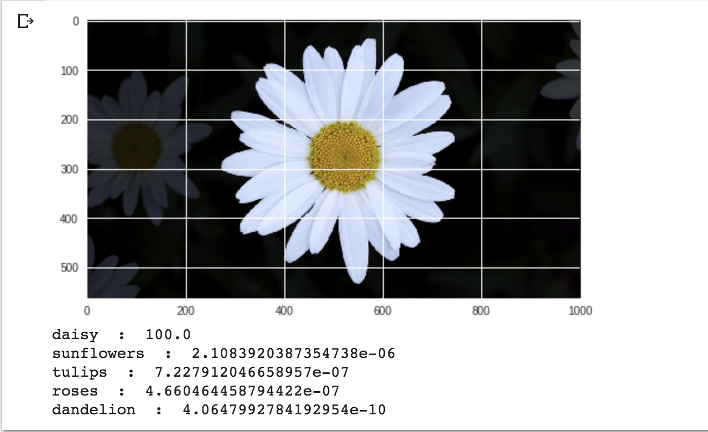
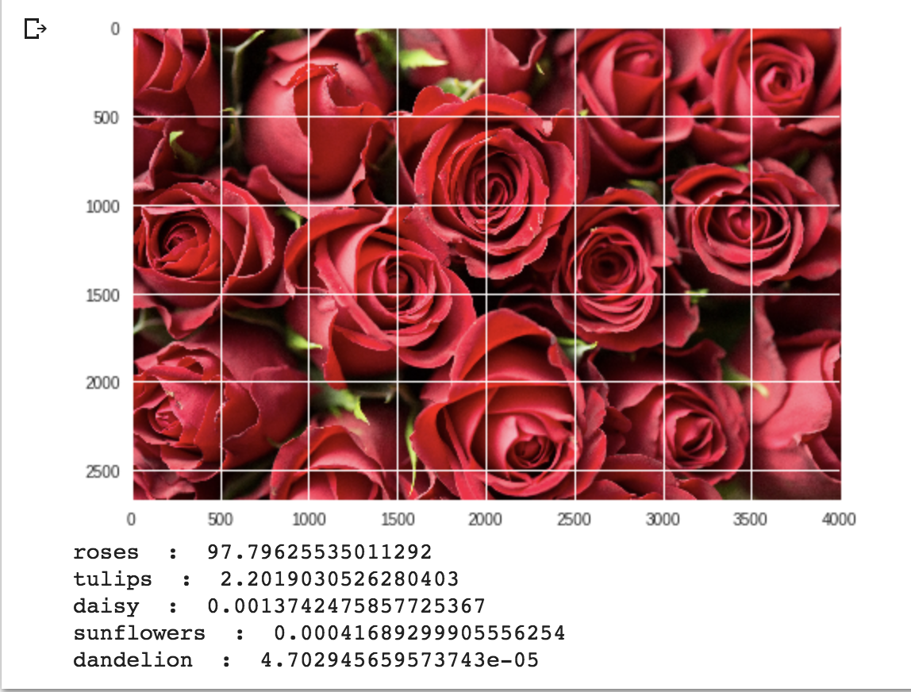

# ImagePrediction
Allows users to predict the Image through Custom Image Prediction class of ImageAI library.
## Overview

The objective of this program is to train a custom classifier to detect and classify images of flowers. 

## Code Links
I have used ImageAI library and the documentation below to train a custom model  using a pre trained resnet model:

```
https://imageai.readthedocs.io/en/latest/custom/index.html
```

I used the following  colab for running my model :

```
https://colab.research.google.com/drive/1KUzb-TQUUTvIpowNO4eeqnKPA4bRCGSk
```

Please note that you need to have the image that you want to predict stored in Google Drive and update the ‘image_path’  variable to the google drive path where image is located.


## Data Set Links
Used the following data set  for predicting flowers:

```
https://drive.google.com/drive/folders/1lAxwH_LD7NhaSfvoR5RSDxpui5-4-Sn8
Which is downloaded from - https://www.kaggle.com/alxmamaev/flowers-recognition#flowers.zip
```

## Details
The code above uses the ImageAI.prediction.custom  library to use existing models and train them on new data set.

## Training 
In this particular project, I have used ModelTraining class to train my model.
I used setModelTypeAsResNet() to set the base model type as ResNet and provide the data directory where I want the new trained model to be stored.

I use 5 different flower classes for my learning and I train the model 100 times on my training data. The test accuracy achieved was ~78%

## Prediction
I used CustomImagePrediction to do the prediction for the test image. I provided the directory from where to load my trained model and a json file to map the labels to output classes.

prediction.predictImage - allowed me to predict the given image using my model e.g see below a sample image from Google for “daisy”, “roses”  being predicted by the model correctly

Here is a sample screenshot for predicting Daisy and Rose



